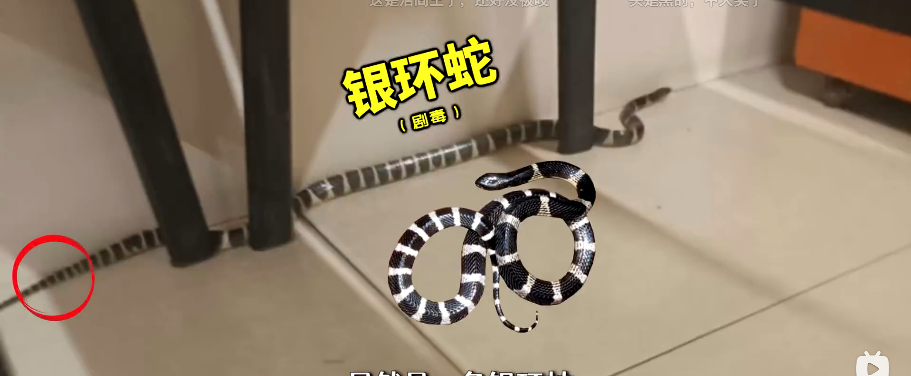
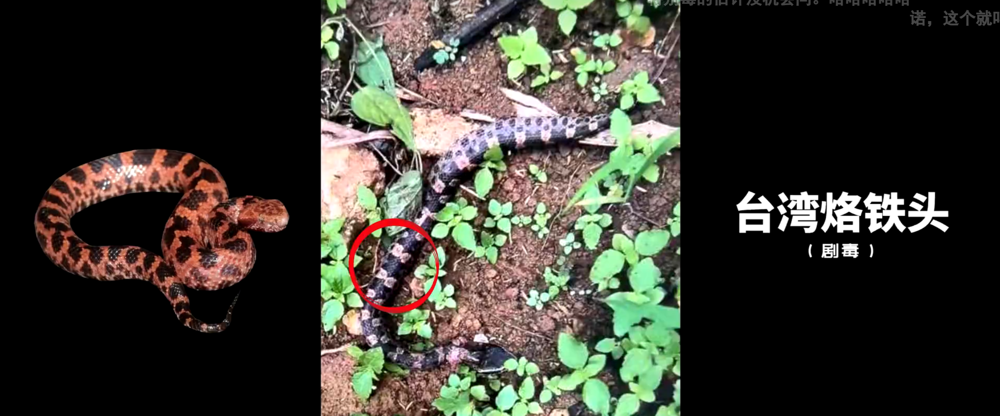
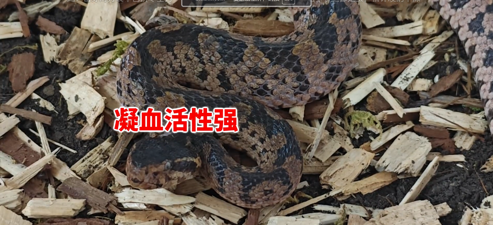
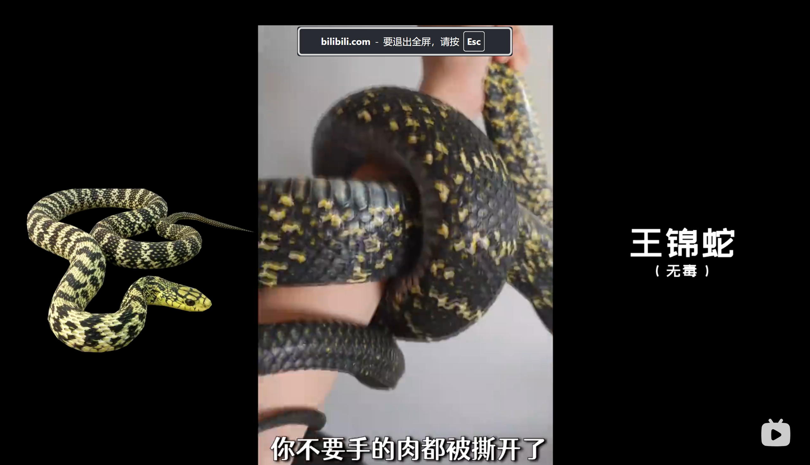
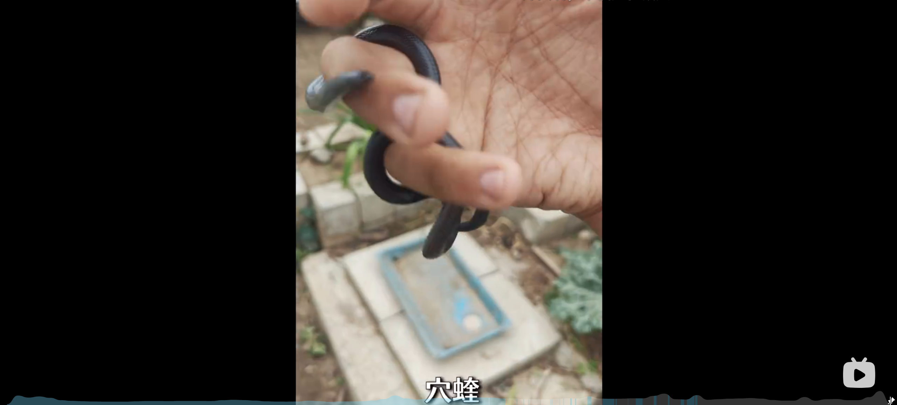
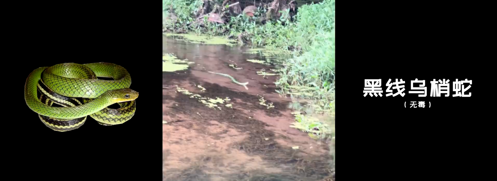

血检查，1小时内一般看不出是否严重，过2-3个小时再次检查

##### 银环蛇

身体环纹规整，尾部间隔急促变短，头部黑色

##### 眼镜王蛇

##### 原矛头蝮（烙铁头）

肌红蛋白升高

肌酸激酶升高：中等严重几千，严重破万

症状：非常痛

背部错开的方形花纹

##### 短尾蝮

神经毒：视线模糊

##### 竹叶青

凝血异常：纤维蛋白原下降，用五步蛇血清，蝮蛇血清没效；

##### 五步蛇（尖吻蝮）   ---五步蛇血清

症状：伤口处发黑坏死，凝血功能异常

凝血异常：>100多检测不出，严重，还可能需要输血

##### 王锦蛇   无毒 

##### 黄斑渔游蛇  无毒 

穴蝰

伤口坏死

心脏毒性

##### 黑线乌梢蛇  无毒

